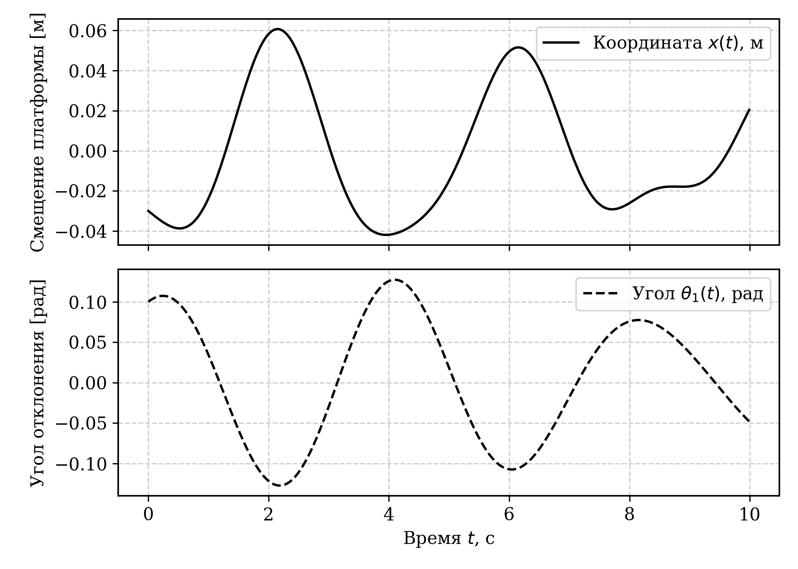
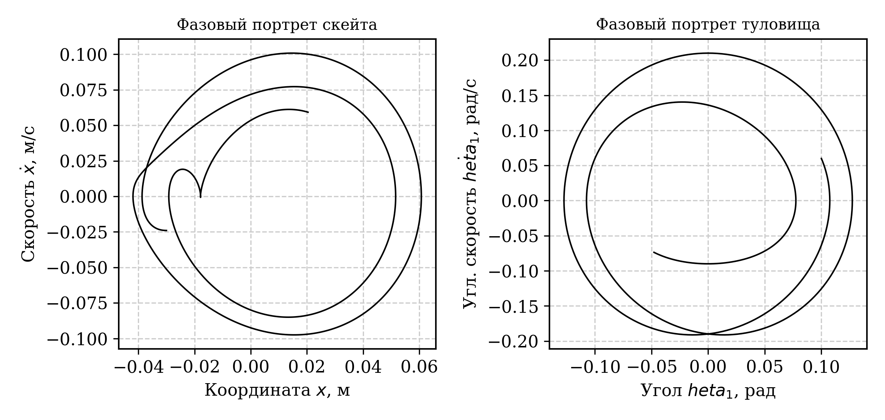

# 🛹 Skateboarder Dynamics Simulator (2D Rigid-Body Mechanics)

Готовый модуль численного и символьного моделирования плоской нелинейной биомеханической системы **«Скейтбордист + Платформа»** с реономными связями. Проект демонстрирует механизмы перераспределения кинетической энергии и импульса в замкнутых многозвенных системах за счет внутренних (активных) маховых движений.

---

## 📌 Особенности проекта

* **Символьный вывод уравнений (SymPy):** Автоматическое построение лагранжиана $L = T - V$ и генерация нелинейной системы ОДУ в матричном виде $A(q,t)\ddot{q} = B(q,\dot{q},t)$.


* **Физический движок (NumPy & RK4):** Собственная реализация явного метода Рунге-Кутты 4-го порядка для численного интегрирования систем дифференциальных уравнений.


* **Контроль законов сохранения:** Поддержка машинной точности сохранения положения общего центра масс (порядка $10^{-6}$ м) при отсутствии внешних горизонтальных сил.


* **Академическая визуализация (Matplotlib):** Генерация кинематических графиков и фазовых портретов, готовых к публикации и монохромной печати.


---

## 📐 Расчетная модель

Система состоит из трех тел в однородном поле тяжести ($g = 9.81 \text{ м/с}^2$):

1. **Платформа (скейтборд):** Поступательное перемещение вдоль оси $Ox$ ($M = 5.0 \text{ кг}$).


2. **Туловище:** Однородный тонкий стержень ($m_1 = 50.0 \text{ кг}$, $L_{body} = 1.6 \text{ м}$).


3. **Верхние конечности (руки):** Материальная точка на невесомой штанге ($m_2 = 10.0 \text{ кг}$, $l_2 = 0.6 \text{ м}$).


Внутреннее управление задается кинематической связью:


$$\phi(t) = A_{\phi} \sin(\omega_{\phi} t), \quad A_{\phi} = 0.5 \text{ рад}, \quad \omega_{\phi} = 2.0 \text{ рад/с}$$

---

## 🚀 Быстрый старт

### Требования

* Python 3.11+
* NumPy, SymPy, Matplotlib

### Установка и запуск

1. Клонируйте репозиторий:
```bash
git clone https://github.com/your-username/skateboarder-dynamics.git
cd skateboarder-dynamics

```


2. Установите зависимости:
```bash
pip install numpy sympy matplotlib

```


3. Запустите симуляцию:
```bash
python main.py

```


---

## 📊 Результаты и графика

| Перемещение и угол | Фазовый портрет |
| :---: | :---: |
|  |  |
* На графиках отчетливо видны замкнутые фазовые траектории и квазипериодический характер движения платформы под действием реактивных сил.


---

## 🛠️ Стек технологий

* **Language:** Python 3.11


* **Symbolic Math:** SymPy


* **Numerics:** NumPy


* **Plotting:** Matplotlib[cite: 2]
